<p align="center">
  
   <h1>c0py.me</h1>
</p>

**Secure Anonymous P2P File Sharing**

A modern, open-source web application for secure peer-to-peer file sharing with a beautiful glassmorphic UI. Built with the MERN stack, WebRTC, and TypeScript.

<p align="center">
  
</p>

<p align="center">
  <a href="https://c0py.me/">🌐 Live Website</a> • 
  <a href="https://youtu.be/kf1zqB7TmNM">📹 Demo Video</a>
</p>

[](https://opensource.org/licenses/MIT)
[](https://www.typescriptlang.org/)
[](https://reactjs.org/)
[](https://webrtc.org/)

## Features

### Core Features
- **Secure P2P Transfer**: Files travel directly between devices using WebRTC. No servers store or access your data.
- **Anonymous Sharing**: Generate random usernames, no accounts required. Share files without revealing your identity.
- **Lightning Fast**: Direct device-to-device transfers eliminate server bottlenecks. Experience maximum transfer speeds.
- **Three Worlds**: Jungle (global), Room (private codes), or Family (same WiFi). Choose your sharing environment.
- **Connection Authorization**: Recipients see file details and approve transfers. No surprise file downloads.
- **Real-time Progress**: Watch animated cubs track transfer progress with live speed and time estimates.

### Advanced Features
- **Robust Dynamic Chunking**: Intelligent chunking system with bidirectional negotiation and metadata
- **Mobile Optimizations**: Intelligent device detection with optimized chunk sizes for mobile devices (8KB chunks)
- **IndexedDB Support**: Large files (>50MB) on mobile devices are stored in IndexedDB to prevent memory issues
- **Adaptive Chunking**: Dynamic chunk sizes based on device type and file size:
  - Mobile devices: 8KB chunks for files <50MB, 16KB for larger files
  - Desktop small files (<100MB): 32KB chunks
  - Desktop medium files (100-500MB): 64KB chunks
  - Desktop large files (>500MB): 64KB chunks (optimized for reliability)
- **Gap Detection & Recovery**: Real-time detection of missing chunks with automatic resend requests
- **Hash-Based Integrity**: SHA-256 verification for each chunk and full file to ensure perfect transmission
- **Retry Logic**: Automatic retry for failed chunks (up to 3 attempts) with exponential backoff
- **Flow Control**: Intelligent buffer management (256KB high, 16KB low) with automatic pause/resume
- **Chunk Pacing**: Adaptive delays based on buffer state to prevent overwhelming the data channel
- **Progress Throttling**: Optimized UI updates (100ms intervals) to prevent performance degradation
- **Cross-Platform**: Full support for mobile, tablet, and desktop devices with responsive design
- **Network Detection**: Automatic mobile data detection with warnings for Family mode (WiFi only)

## File Transfer Flow

The application uses a robust chunking system with dynamic sizing, gap detection, integrity verification, and automatic recovery:

```mermaid
flowchart TD
    subgraph Sender[Sender Side]
        A[File Selected] --> B[Calculate File Hash SHA-256]
        B --> C{Is Mobile?}
        C -->|Yes| D{File Size > 50MB?}
        C -->|No| E[Use In-Memory File]
        D -->|Yes| F[Store to IndexedDB]
        D -->|No| E
        F --> G[Create Transfer Manifest]
        E --> G
        
        G --> H[Send transfer-manifest]
        H --> I[Receive manifest-ack]
        I --> J[Negotiate Chunk Size]
        J --> K{Calculate Chunk Size}
        K -->|Mobile| L[8KB or 16KB]
        K -->|Desktop| M{File Size?}
        M -->|>500MB| N[64KB Chunks]
        M -->|>100MB| O[64KB Chunks]
        M -->|Other| P[32KB Chunks]
        
        L --> Q[Generate Chunk with Metadata]
        N --> Q
        O --> Q
        P --> Q
        
        Q --> R[Create Binary Chunk Header]
        R --> S[Send Chunk with Hash]
        S --> T{Buffer Check}
        T -->|>256KB| U[Pause & Wait]
        T -->|<16KB| V{Adaptive Delay}
        V -->|Buffer >128KB| W[Wait 10ms]
        V -->|Buffer >64KB| X[Wait 5ms]
        V -->|Other| Y[No Delay]
        W --> Z[Send Next Chunk]
        X --> Z
        Y --> Z
        U --> AA[onbufferedamountlow]
        AA --> Z
        
        Z --> AB{ACK Received?}
        AB -->|Yes| AC{More Chunks?}
        AB -->|Resend Request| AD[Resend Missing Chunks]
        AD --> Q
        AC -->|Yes| Q
        AC -->|No| AE[Send transfer-end]
        AE --> AF[Wait for transfer-complete]
    end
    
    subgraph Receiver[Receiver Side]
        AG[Receive transfer-manifest] --> AH[Calculate File Hash]
        AH --> AI[Send manifest-ack]
        AI --> AJ[Initialize Chunk Bitmap]
        AJ --> AK[Receive Binary Chunk]
        AK --> AL[Parse Chunk Header]
        AL --> AM[Verify Chunk Hash]
        AM -->|Valid| AN[Store Chunk]
        AM -->|Invalid| AO[Request Resend]
        AO --> AK
        
        AN --> AP{Is Mobile?}
        AP -->|Yes| AQ{File Size > 50MB?}
        AP -->|No| AR[Store in Memory Map]
        AQ -->|Yes| AS[Write to IndexedDB]
        AQ -->|No| AR
        
        AS --> AT[Update Bitmap]
        AR --> AT
        AT --> AU[Mark Chunk Received]
        AU --> AV{Gap Detected?}
        AV -->|Yes| AW[Request Resend for Gaps]
        AV -->|No| AX[Send chunk-ack]
        AW --> AK
        AX --> AY{All Chunks Received?}
        AY -->|No| AK
        AY -->|Yes| AZ[Receive transfer-end]
        AZ --> BA[Assemble File from Chunks]
        BA --> BB{From IndexedDB?}
        BB -->|Yes| BC[Read from IDB & Create Blob]
        BB -->|No| BD[Create Blob from Memory]
        BC --> BE[Verify Full File Hash]
        BD --> BE
        BE -->|Match| BF[Send transfer-complete]
        BE -->|Mismatch| BG[Send transfer-failed]
        BF --> BH[File Ready]
    end
    
    Sender -.->|WebRTC DataChannel| Receiver
```



## How It Works

1. **Choose Your World**
   - **Jungle**: Connect with anyone globally in the public space
   - **Room**: Create or join private rooms with unique codes
   - **Family**: Connect with devices on the same WiFi network (WiFi only, mobile data detection included)

2. **Select & Send Request**
   - Drag & drop files or click to select
   - Choose a recipient from the available peers
   - The system automatically detects your device type and optimizes the transfer
   - Recipient sees file details and can accept or decline

3. **Robust File Transfer**
   - File hash calculated using SHA-256 before transfer
   - Transfer manifest sent with file metadata and proposed chunk size
   - Chunk size negotiated between sender and receiver
   - Files automatically stored in IndexedDB on mobile if >50MB
   - Each chunk includes metadata (sequence, offset, size, hash)
   - Real-time gap detection with automatic resend requests
   - Flow control with adaptive pacing prevents buffer overflow
   - Per-chunk hash verification ensures data integrity
   - Retry logic handles transient failures (up to 3 attempts)
   - Final file hash verification confirms perfect transmission
   - Real-time progress tracking with throttled UI updates
   - Direct P2P transfer via WebRTC (no server storage)

4. **Receive & Verification**
   - Recipient receives transfer manifest and acknowledges
   - Chunks received with metadata and verified individually
   - Missing chunks detected via bitmap tracking
   - Automatic resend requests for gaps or hash mismatches
   - Large files stored in IndexedDB automatically
   - File assembled from verified chunks in correct order
   - Final SHA-256 hash verification ensures integrity
   - File ready for download with original metadata preserved

## Architecture

### Tech Stack
- **Frontend**: React 18, TypeScript, Framer Motion, Tailwind CSS
- **Backend**: Node.js, Express.js, Socket.IO
- **Real-time**: WebRTC, WebSocket signaling
- **Storage**: IndexedDB (for large files on mobile), In-memory (for smaller files)
- **Build Tools**: Turborepo, Vite, pnpm
- **Database**: MongoDB (user sessions and metadata only, no file storage)
- **Caching**: Redis (for pending requests and session management)

### Monorepo Structure
```
sharedrop/
├── apps/
│   ├── web/          # React frontend application
│   └── api/          # Express.js backend API
├── packages/
│   ├── ui/           # Shared UI components
│   ├── database/     # Database models and utilities
│   └── config/       # Shared configuration
├── tools/
│   ├── eslint-config/    # Shared ESLint configuration
│   └── typescript-config/ # Shared TypeScript configuration
└── turbo.json        # Turborepo configuration
```

## Quick Start

### Prerequisites
- Node.js 18+ 
- pnpm 8+
- MongoDB (local or Atlas)
- Redis (optional, for enhanced features)

### Installation

1. **Clone the repository**
   ```bash
   git clone https://github.com/yourusername/sharedrop.git
   cd sharedrop
   ```

2. **Install dependencies**
   ```bash
   pnpm install
   ```

3. **Set up environment variables**
   ```bash
   # apps/api/.env
   MONGODB_URI=mongodb://localhost:27017/c0py-me
   PORT=3001
   CLIENT_URL=http://localhost:5173
   REDIS_URL=redis://localhost:6379  # Optional
   
   # apps/web/.env
   VITE_API_URL=http://localhost:3001
   ```

4. **Start development servers**
   ```bash
   # Terminal 1: Backend
   pnpm --filter @sharedrop/api dev
   
   # Terminal 2: Frontend
   pnpm --filter @sharedrop/web dev
   ```

5. **Open your browser**
   - Frontend: http://localhost:5173
   - Backend: http://localhost:3001

## Usage Guide

### Getting Started

1. **Visit [c0py.me](https://c0py.me/)** or open locally
2. **Choose your world**:
   - **Jungle**: Connect with anyone globally
   - **Room**: Create/join private rooms with codes
   - **Family**: Connect with devices on same WiFi (mobile data detection warns users)

3. **Share files**:
   - Drag & drop files or click to select
   - System automatically detects device type and optimizes transfer
   - Choose a recipient from the available peers
   - Watch the animated cub track progress in real-time
   - Files transfer directly between devices

### File Transfer Process

1. **File Selection**: Select files (system detects device and file size)
2. **Hash Calculation**: SHA-256 hash calculated for entire file
3. **Storage Decision**: Large files on mobile stored in IndexedDB automatically
4. **Connection Request**: Sender requests connection with recipient
5. **Authorization**: Recipient approves via modal with file details
6. **WebRTC Handshake**: Secure peer-to-peer connection established
7. **Manifest Exchange**: Sender sends transfer manifest, receiver acknowledges and negotiates chunk size
8. **Adaptive Chunking**: Chunk size determined by device and file size (negotiated between peers)
9. **Chunk Transfer**: Each chunk sent with metadata header (sequence, offset, size, hash)
10. **Gap Detection**: Receiver tracks received chunks in bitmap, detects gaps in real-time
11. **Automatic Recovery**: Missing chunks automatically requested for resend
12. **Flow Control**: Buffer management (256KB high, 16KB low) with adaptive pacing
13. **Integrity Verification**: Each chunk hash verified, full file hash verified at completion
14. **Retry Logic**: Failed chunks retried up to 3 times with exponential backoff
15. **Completion**: File assembled from verified chunks, hash verified, ready for download

### Supported File Types
- **All file types** supported (no restrictions)
- **Large files** handled efficiently with IndexedDB on mobile
- **Multiple files** can be transferred simultaneously
- **No size limits** (browser storage dependent)

### Device-Specific Features

#### Mobile Devices
- Automatic IndexedDB storage for files >50MB
- 8KB chunk size for stability
- Mobile data detection and warnings
- Touch-optimized UI
- Responsive design

#### Desktop Devices
- In-memory file handling for most files
- Adaptive chunk sizes (64KB-256KB)
- Larger buffer sizes
- Keyboard shortcuts
- Full feature set

## Development

### Available Scripts

```bash
# Development
pnpm dev                    # Start all dev servers
pnpm --filter @sharedrop/web dev    # Frontend only
pnpm --filter @sharedrop/api dev    # Backend only

# Building
pnpm build                  # Build all packages
pnpm --filter @sharedrop/web build  # Build frontend
pnpm --filter @sharedrop/api build  # Build backend

# Linting
pnpm lint                   # Lint all packages
pnpm --filter @sharedrop/web lint   # Lint frontend
pnpm --filter @sharedrop/api lint   # Lint backend

# Type checking
pnpm type-check             # Type check all packages
```

### Project Structure

#### Frontend (`apps/web/`)
```
src/
├── components/     # React components
│   ├── LionsDen.tsx      # Main file sharing interface
│   ├── RoomModal.tsx     # Room creation/joining
│   ├── CubProgress.tsx   # Animated progress indicator
│   ├── IncomingFileModal.tsx  # File authorization
│   └── ...
├── hooks/         # Custom React hooks
│   ├── useSocket.ts      # Socket.IO connection management
│   ├── useWebRTC.ts      # WebRTC peer connection management
│   └── ...
├── pages/         # Page components
│   ├── LandingPage.tsx  # Landing page
│   ├── AppPage.tsx      # Main application page
│   └── ...
├── types/         # TypeScript type definitions
├── utils/         # Utility functions
│   ├── deviceInfo.ts    # Device detection and info
│   ├── format.ts        # File size and speed formatting
│   └── ...
└── main.tsx       # Application entry point
```

#### Backend (`apps/api/`)
```
src/
├── routes/        # API routes
│   ├── routes.ts         # Main API routes
│   └── logs.ts           # Logging endpoints
├── socketService.ts      # Socket.IO service
├── server.ts      # Server entry point
└── ...
```

### Key Components

#### WebRTC Integration
- **Peer Connection**: Manages WebRTC connections with automatic cleanup
- **Data Channels**: Handles file transfer with flow control
- **Signaling**: Socket.IO for connection establishment
- **ICE Handling**: STUN server configuration for NAT traversal
- **Flow Control**: Buffer management with automatic pause/resume

#### File Handling
- **Device Detection**: Automatic mobile/tablet/desktop detection
- **IndexedDB Integration**: Large file storage on mobile devices (>50MB)
- **Hash Calculation**: SHA-256 hashing for file and chunk integrity
- **Robust Chunking**: Dynamic chunk sizes with bidirectional negotiation
- **Chunk Metadata**: Each chunk includes sequence, offset, size, and hash
- **Gap Detection**: Bitmap-based tracking with real-time gap identification
- **Automatic Recovery**: Missing chunks automatically requested and resent
- **Integrity Verification**: Per-chunk and full-file hash verification
- **Retry Logic**: Automatic retry for failed chunks with exponential backoff
- **Flow Control**: Intelligent buffer management with adaptive pacing
- **Progress Tracking**: Throttled UI updates (100ms intervals) for performance
- **Memory Management**: Efficient handling of large files with IndexedDB

#### UI Components
- **GlassCard**: Reusable glassmorphic card component
- **Avatar**: User avatar with emoji and colors
- **CubProgress**: Animated progress indicator with speed/time estimates
- **Toast**: Notification system with sound feedback
- **Radar**: Peer visualization component

## Deployment

### Production Deployment

1. **Build the application**
   ```bash
   pnpm build
   ```

2. **Set up environment variables**
   ```bash
   # Production environment variables
   MONGODB_URI=your_mongodb_atlas_uri
   REDIS_URL=your_redis_url  # Optional
   PORT=3001
   CLIENT_URL=https://c0py.me
   NODE_ENV=production
   ```

3. **Deploy to your preferred platform**
   - **Vercel/Netlify**: Frontend deployment
   - **Railway/Render**: Backend deployment
   - **MongoDB Atlas**: Database hosting
   - **Redis Cloud**: Caching and session management

### Docker Deployment

   ```bash
# Build and run with Docker
docker build -t c0py-me .
docker run -p 3001:3001 c0py-me
```

## Security

### Privacy Features
- **No File Storage**: Files never touch our servers
- **Anonymous Users**: Random usernames, no accounts required
- **Direct P2P**: End-to-end encrypted transfers via WebRTC
- **Connection Authorization**: Recipients approve transfers
- **No Logging**: We don't log file transfers or user data
- **IndexedDB Privacy**: Files stored locally on user's device only

### Technical Security
- **WebRTC Encryption**: Built-in DTLS/SRTP encryption for all transfers
- **HTTPS Only**: Secure connections in production
- **Input Validation**: All user inputs validated and sanitized
- **CORS Protection**: Proper cross-origin resource sharing
- **Rate Limiting**: API rate limiting to prevent abuse
- **Session Management**: Secure session handling with Redis

## Performance Optimizations

### Transfer Optimizations
- **Robust Chunking Protocol**: Bidirectional negotiation ensures optimal chunk sizes
- **Dynamic Chunk Sizing**: 8KB-64KB chunks based on device and file size
- **Gap Detection & Recovery**: Real-time detection and automatic resend of missing chunks
- **Hash-Based Integrity**: SHA-256 verification for each chunk and full file
- **Retry Logic**: Automatic retry (up to 3 attempts) with exponential backoff
- **Flow Control**: Buffer thresholds (256KB high, 16KB low) prevent overflow
- **Adaptive Pacing**: Dynamic delays (0-10ms) based on buffer state
- **Progress Throttling**: UI updates throttled to 100ms intervals
- **IndexedDB**: Efficient storage for large files (>50MB) on mobile devices
- **Connection Reuse**: Efficient WebRTC connection management
- **Chunk Metadata**: Binary headers (48 bytes) with sequence, offset, size, hash

### Memory Management
- **Mobile**: IndexedDB for files >50MB to prevent memory issues
- **Desktop**: In-memory for most files with efficient chunking
- **Automatic Cleanup**: Proper resource cleanup after transfers
- **Buffer Management**: Intelligent buffer size management

## Browser Compatibility

### Supported Browsers
- **Chrome**: 56+ (Full WebRTC support, IndexedDB support)
- **Firefox**: 52+ (Full WebRTC support, IndexedDB support)
- **Safari**: 11+ (Limited WebRTC support, IndexedDB support)
- **Edge**: 79+ (Full WebRTC support, IndexedDB support)
- **Mobile Browsers**: iOS Safari, Chrome Mobile, Firefox Mobile

### Feature Detection
- WebRTC API availability checking
- IndexedDB availability checking
- Data channel support verification
- STUN server connectivity testing
- Device type detection
- Network information API

## Contributing

We welcome contributions! Please see our [Contributing Guide](docs/CONTRIBUTING.md) for details.

### Development Setup
1. Fork the repository
2. Create a feature branch
3. Make your changes
4. Add tests if applicable
5. Submit a pull request

### Code Style
- Use TypeScript for all new code
- Follow ESLint configuration
- Use Prettier for formatting
- Write meaningful commit messages
- Add JSDoc comments for complex functions

## License

This project is licensed under the MIT License - see the [LICENSE](LICENSE) file for details.

## Documentation

Comprehensive documentation is available in the [`docs/`](docs/) directory:

- **[Documentation Index](docs/README.md)** - Complete documentation overview
- **[Architecture](docs/architecture/ARCHITECTURE.md)** - System architecture and design
- **[API Documentation](docs/API.md)** - API endpoints and WebSocket events
- **[Deployment Guide](docs/deployment/DEPLOYMENT.md)** - Production deployment instructions
- **[Contributing Guide](docs/CONTRIBUTING.md)** - How to contribute to the project
- **[Development Instructions](docs/development/instructions.md)** - Development setup and guidelines

## Support

- **Live Website**: [https://c0py.me/](https://c0py.me/)
- **Demo Video**: [Watch on YouTube](https://youtu.be/kf1zqB7TmNM)
- **Documentation**: See [docs/](docs/) for comprehensive documentation
- **Issues**: Report bugs and feature requests on [GitHub](https://github.com/sanath1599/c0py.me/issues)
- **Discussions**: Join community discussions on [GitHub](https://github.com/sanath1599/c0py.me/discussions)

## Acknowledgments

- **WebRTC**: For peer-to-peer communication
- **React**: For the amazing frontend framework
- **Framer Motion**: For smooth animations
- **Tailwind CSS**: For utility-first styling
- **Socket.IO**: For real-time signaling
- **IndexedDB**: For efficient mobile file storage

---

**Made with love for secure, anonymous file sharing**

<p align="center">
  <a href="https://c0py.me/">🌐 Visit c0py.me</a> • 
  <a href="https://youtu.be/kf1zqB7TmNM">📹 Watch Demo</a>
</p>
